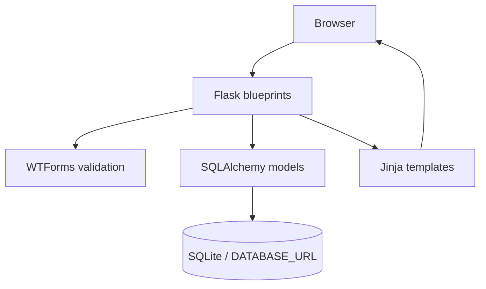
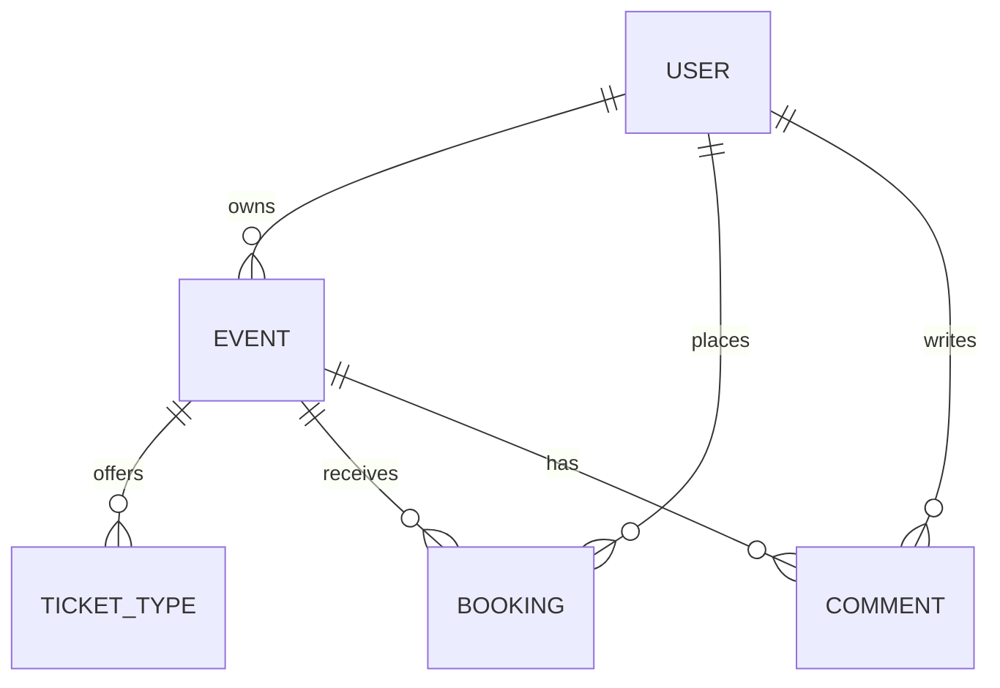

# Bollywood Beats

A full-stack Flask event marketplace for discovering, publishing, and booking live music events.

Bollywood Beats supports both sides of an event platform: attendees can search events, book tickets, leave comments, and review order history, while organisers can create events, define ticket tiers, manage availability, and update or cancel listings.

## Highlights

- Account registration and login with PBKDF2 password hashing
- Searchable event catalogue with category filters
- Event creation and editing with image uploads
- Multiple ticket tiers, prices, and stock quantities
- Capacity-aware bookings with unique order IDs
- Automatic `Open`, `Sold Out`, `Inactive`, and `Cancelled` status transitions
- Attendee comments and personal booking history
- Organiser dashboard for owned events
- Responsive server-rendered UI with Bootstrap
- Custom 404 and 500 error pages

## Tech stack

| Area | Technology |
| --- | --- |
| Backend | Python, Flask |
| Database | SQLite, SQLAlchemy |
| Authentication | Flask-Login, Werkzeug |
| Forms and validation | Flask-WTF, WTForms |
| Front end | Jinja, Bootstrap 5, HTML, CSS |

## Architecture



The application uses a Flask application factory, separate authentication and main blueprints, form objects for server-side validation, and SQLAlchemy relationships for users, events, bookings, comments, and ticket types.

## Data model



## Getting started

### Prerequisites

- Python 3.10 or newer
- `pip`

### Install and run

```bash
git clone https://github.com/harrybhatiadevs/IAB207_A2.git
cd IAB207_A2

python3 -m venv .venv
source .venv/bin/activate
pip install -r requirements.txt
python main.py
```

On Windows, activate the environment with:

```powershell
.venv\Scripts\Activate.ps1
```

Then open [http://127.0.0.1:5000](http://127.0.0.1:5000).

The application creates its SQLite database in the Flask `instance/` directory and seeds a small demo catalogue on first run.

### Demo organiser account

```text
Username: demo_owner
Password: demo1234
```

This account is development-only sample data. Create a separate account to test attendee and organiser workflows independently.

## Configuration

The default database is local SQLite. To use another SQLAlchemy-compatible database, set:

```bash
export DATABASE_URL="your-database-url"
```

No environment variable is required for the standard local setup.

## Core workflows

### Attendee

1. Browse or search the event catalogue.
2. Open an event to review ticket availability and comments.
3. Register or log in.
4. Book an available quantity.
5. View the generated order ID in booking history.

### Organiser

1. Log in and create an event.
2. Add up to five ticket tiers with independent price and quantity.
3. Edit details or upload a replacement event image.
4. Review owned events and current availability.
5. Cancel or delete an event when appropriate.

## Project structure

```text
BollywoodBeats/
├── __init__.py          # app factory, extensions, seed data
├── auth.py              # login, registration, logout
├── forms.py             # validation and form definitions
├── models.py            # relational domain model
├── views.py             # catalogue, booking, organiser routes
├── static/              # styles and event images
└── templates/           # Jinja pages and reusable partials
main.py                  # development entry point
requirements.txt
```

## Engineering details

- Booking stock is derived from ticket tiers when they exist, with event capacity as a fallback.
- Money values use `Decimal` and fixed-precision database columns rather than binary floating point.
- Statuses are refreshed from event time and remaining capacity before relevant pages render.
- Uploaded images receive unique filenames to avoid collisions.
- Owner checks protect event edit, cancel, and delete operations.
- Authentication accepts either username or email.

## Scope and future improvements

This is a portfolio and university team project, not a production ticketing service. Payments are simulated and the local development server is not hardened for internet deployment.

Useful next steps would be automated route and model tests, database migrations, cloud object storage for uploads, payment-provider integration, transactional booking locks, and a production deployment configuration.
